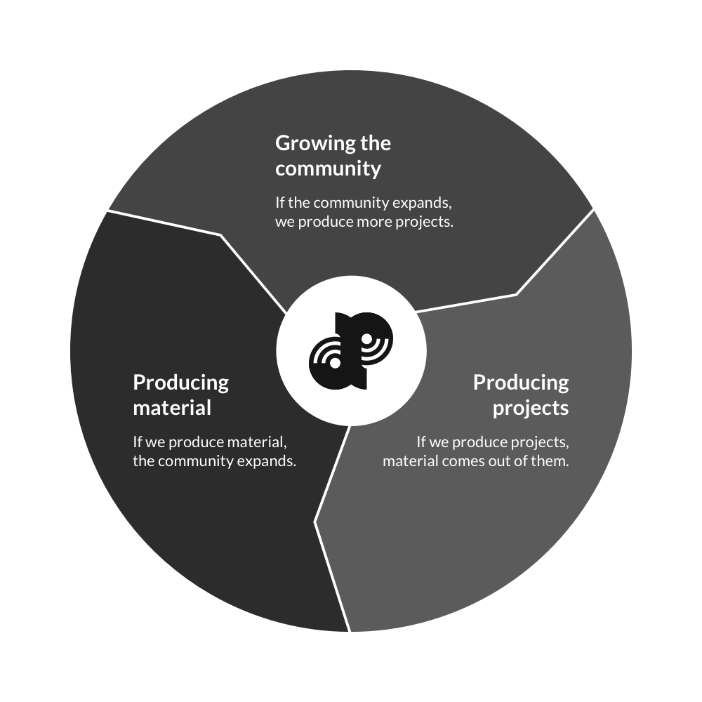

# Getting Started with DappSociety
Welcome to the DappSociety community. We are happy for you to join us. This document will help you get up to speed and hit the ground running so you can start contributing in a way that best suits you.

If you haven't already, please read [About DappSociety](#) as well as our [Community Code of Conduct](#).

## Join in on the Chat Discussions
The easiest way to get started with DappSociety is to simply be active in the chat channels. Here is a helpful [Guide to the DappSociety Chat Channels](#).

Start out by introducing yourself in `#introductions` to give us a heads up on your background and skills.

After introducing yourself, take a look around at all the available channels, read through previous messages, ask questions, share your suggestions, and just get comfortable.

## Participate in our Social Media Channels
These have not been fully implemented yet because we are focusing on laying the groundwork for one thing at a time. However, any and all involvement helps. Subscribe/follow and help us spread the word.

- Subscribe to the [DappSociety SubReddit](#)
- Follow [@DappSociety on Twitter](#)
- Subscribe to the [DappSociety Medium Publication](#)

## Contribute Value to DappSociety and the World
There are many ways to contribute, and everyone can contribute in their own way.

Our guiding tasks can be visualized as a simple cycle. If you're ever wondering what you could do to contribute, think about these three core objectives.

### Specific Examples of How to Contribute
Although the image above presents a high-level view of value-adding tasks, we can also give some more concrete examples.

>**Note:** If you ever need access to *any* other team application (Trello, GitHub, etc) or elevated permissions to help manage a communication channel (Slack, Twitter, Reddit, Medium), simply make a request in the `#access-requests` channel.

#### Ask and Answer Questions
Asking questions is a great way to add value. By asking questions, you provoke thought. And when anyone thinks about something in a new way, that thought could spark tangible output in the form of code, artwork, writing, and more. To put it simply: *Asking questions* equals *producing material*.

The best place to start asking topic-specific questions is in one of the `#qa-` channels. If you think we should create a channel for a new topic, share that thought in the `#dips` channel.

#### Give Suggestions for Improving the Community
Our community is owned and organized by its members. Therefore, it is very important for everyone to help in improving it.

Getting started with that is easy. Go to the `#dips` (DappSociety Improvement Proposals) channel to give ideas for and discuss community improvements.

#### Cast Your Vote on Community Decisions
We currently achieve group consensus on decisions through simple chat-based polls. You can find all of these polls in the `#ballot-bot` channel.

Each poll will list choices with a corresponding emoji. You cast your vote in the poll by reacting to the actual poll message (no other referencing messages) with the emoji that represents your choice.

#### Participate in Community Meetings
Community meetings are planned and archived in the [DappSociety Meetings Repository](#). From there you can view past meetings and keep up to date on when our next community meeting might be. You can also propose edits to any of the meeting documents, leave comments, or submit issues.

Meeting times are chosen through polls in `#ballot-box`, so be sure to watch out for them and let us know what times work best for you. We typically select two sessions per meeting to better accommodate all schedules.

Meetings are held in dedicated channels with the following naming convention: `#group-meeting-YYMMDD`.

#### Read and Curate Content
Inside the `#content-kiosk` channel, community members share content they find helpful or interesting. This is a great place to scan and get an overview of what other members are currently reading.

If you come across some interesting content you think others might enjoy, please go ahead and share it in there.

However, the Content Kiosk isn't the only place for sharing content. You are also encouraged to share things in the [DappSociety SubReddit](#).

#### Create / Edit Content
This one is more time intensive, but it offers larger personal rewards. By creating content, you are directly contributing to both the DappSociety and the World knowledge base while simultaneously building exposure and a reputation for yourself.

Creating content can also be a little scary. But know that even if you're unsure of them, your ideas are valuable. And you don't need to worry about fully polishing your content. The DappSociety community is very supportive and is here to help.

Create a draft of your content and share it with the group in `#accomplishments`. If you're looking for feedback or help, just ask. This is especially true if you want help rewording your ideas or improving the English grammar. Or even if you want to have your ideas translated from one language to another.

##### Wiki
This is our master content repository. All community content (excluding opinion pieces) can be stored here. All members can add/edit content and each document is automatically published on the community website.

When appropriate, we extract repositories from the wiki and into their own. Current examples include `digests`, `meetings`, and `dips`.

##### Medium
Medium can be seen as our community blog. It is a great place to share your personal point-of-view and opinions on any number of topics. Unlike the content stored in Git repositories which are collaborative efforts, you are the only person in charge of your Medium articles.

Some good examples of content suitable for the Medium publication include:

- Updates on events within the community
- Your opinion on a community project
- Aggregation of current events in blockchain
- Your personal opinion/spin on a piece of content in the wiki

##### Social Media
Although the Git repositories and Medium publication are two of the best places to store your content, you may also post helpful content directly to the SubReddit, Facebook Page, or Twitter account.

#### Join Existing Projects
There are several projects going on within DappSociety at all times, and the number will only continue to grow. This is great news if you just want to jump in and start contributing right away.

Projects can be broken up into two classifications: "working groups" and "private projects."

##### Working Groups
Any existing community project, or private project that has opened itself up to permissionless community involvement is called a working group.

A working group is a team. These teams are organized around any type of task ranging from brainstorming to research to full-scale application development. Anything a group can work together on can be considered a working group.

The easiest way to find existing working groups is to view the channel list and browse through those prefixed with `#wg-`. You do not need permission to join one of these channels, but once you join, it is recommended to introduce yourself to the channel and ask how you can be of help.

Any member is free to create a new working group. To do so, simply create a channel with the `#wg-` prefix and recruit other members to join you.

##### Private Projects
In addition to public working groups, it is completely acceptable for members to team up on private projects. However, these are obviously not as easy to find and join.

If you are looking to join a private project, you should start out by being active in the discussions and making friends. Do that long enough and if an opportunity does exists, it is likely you will come across it.

If you don't want to wait for an opportunity to find you, you can always make your own by sharing ideas and starting projects.

#### Share Ideas For / Start a New Project
In the first few days of DappSociety, members were especially interested in sharing ideas and starting new projects together. That still is, and will always be, very much a part of our culture.

If you have an idea for a Dapp or other blockchain related project, you are encouraged to share it with the group. The benefits of sharing are usually greater than keeping the idea to yourself. If you are concerned about your ideas being stolen, please refer to our [Code of Conduct](#) and [Community Governance Model](#)

Also keep in mind that the only "required" goal for a project is that its members learn something. That's it. So your project doesn't need to be a grand idea, doesn't need to have a business model, doesn't even need to have an expectation of being completed.

If two members join together, strengthen their relationship, and learn something, that is a success. If they end up producing and sharing content or code created throughout the process, that is a success. A project does not need to turn into a completed Dapp in order to be deemed a success.

#### Volunteer to Help with the Community
Lastly, there is always more work to be done to improve our community and create a better experience for all existing and future members.

If you would like to donate some of your time to this cause, simply state your intentions in one of the channels and we will help you to get started.
